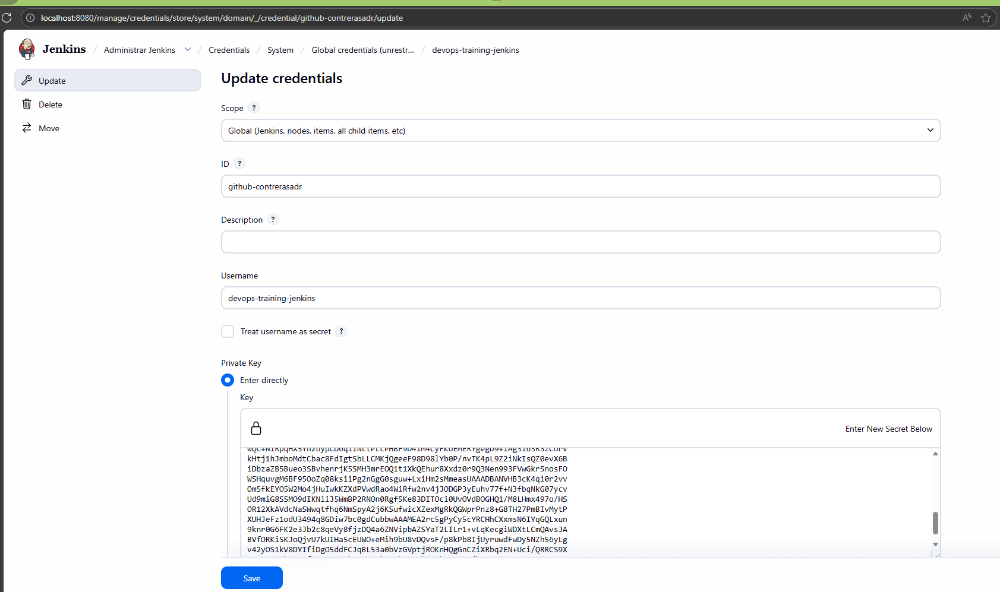
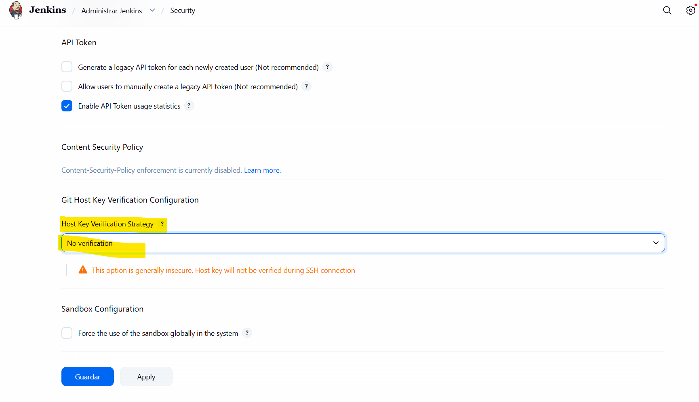
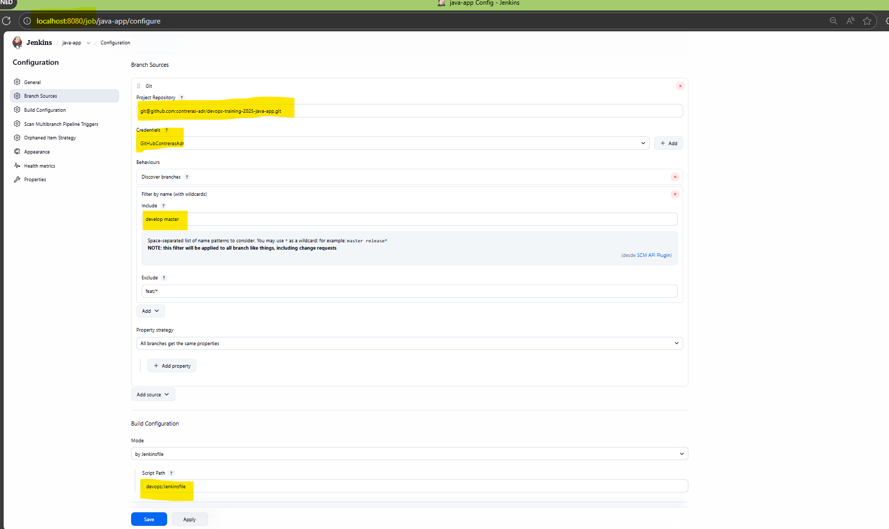

# Práctica 1 - Instalación de Jenkins en local y configuración base

En esta práctica instalaremos y configuraremos Jenkins en local para poder ejecutar el resto del curso.

## Objetivos
- Instalar y arrancar Jenkins en local con los plugins mínimos.
- Configurar acceso a Git (SSH) para que Jenkins pueda leer repositorios.
- Preparar Multi-branch Pipelines para los repos de Python y Java.
- Dejar Jenkins listo para ejecutar steps en contenedores (Docker) de forma aislada.

## Repos relacionados y ramas
- Repo Python (base `feat/base`): https://github.com/contreras-adr/devops-training-python-app/tree/feat/base
- Repo Python (solucion `training-1-jenkins-config`): https://github.com/contreras-adr/devops-training-python-app/tree/training-1-jenkins-config
- Repo Java (base `feat/base`): https://github.com/contreras-adr/devops-training-java-app/tree/feat/base
- Repo Java (solucion `training-1-jenkins-config`): https://github.com/contreras-adr/devops-training-java-app/tree/training-1-jenkins-config
- Repo IaC/DevOps (base `feat/base`): https://github.com/contreras-adr/devops-training-iac-devops/tree/feat/base
- Repo IaC/DevOps (solucion `training-1-jenkins-config`): https://github.com/contreras-adr/devops-training-iac-devops/tree/training-1-jenkins-config

## Prerequisitos
- Docker y Docker Compose instalados.
- Opcional (si estás en Windows): WSL2 Ubuntu 22.04.
  - https://gist.github.com/Adhjie/8dcab8ef69a82e0b35d017725f20de19
  - https://documentation.ubuntu.com/wsl/en/latest/howto/install-ubuntu-wsl2/

## Docker Compose (stack de Jenkins) - fichero existente
En este curso se levanta un stack local con Docker Compose para tener Jenkins y sus dependencias de CI/CD en la misma red Docker. Esto permite crear “entornos virtualizados” (contenedores) para ejecutar steps de los pipelines sin depender del Docker del host.

Consulta el fichero:
- `devops-training-iac-devops/docker-compose.yml`

Resumen de lo que despliega:
- Red `devops_training_net` (bridge) con subnet `172.16.236.0/24`
- Volumen `jenkins-data` para persistir `/var/jenkins_home`
- Volumen `jenkins-docker-certs` para certificados TLS entre Jenkins y DinD
- Volumen `registry-data` para persistencia del Docker Registry local
- Volumen `artifactory-data` para persistencia de Artifactory
- Servicio `dind` (Docker API por TLS en 2376)
- Servicio `jenkins` (UI en 8080 y agentes inbound en 50000)
- Servicio `registry` (`local-registry:5000`)
- Servicio `artifactory` (`artifactory:8081`)

Nota importante para el curso:
- En la Práctica 1, el foco es Jenkins + DinD.
- `registry` y `artifactory` se usan a partir de la Práctica 2 (publish de imágenes y artefactos), por eso ya vienen incluidos en el stack.

## Configurar plugins de Jenkins
Antes de levantar Jenkins, define plugins en:
- `devops-training-iac-devops/jenkins/plugins.txt`

Nota:
- Si cambias esta lista y ya tienes Jenkins con volumen persistente, deberás borrar el volumen para aplicar bien el cambio.

## Arrancar Jenkins
```bash
docker-compose up -d
docker-compose logs jenkins
```

Al ejecutar `docker-compose up -d` se levantan todos los servicios definidos en el stack (`jenkins`, `dind`, `registry`, `artifactory`).

## Desbloquear Jenkins (primer arranque)
Cuando Jenkins arranca por primera vez, muestra la contraseña inicial en los logs. La ruta dentro del contenedor suele ser:
```
/var/jenkins_home/secrets/initialAdminPassword
```

En la UI de Jenkins, copia y pega esa contraseña en la pantalla de “Unlock Jenkins” y continúa el asistente.

## Crear clave SSH de GitHub para Jenkins
```bash
ssh-keygen -C "contreras.adr@outlook.com" -f ~/.ssh/jenkins-github
cat ~/.ssh/jenkins-github.pub
```

Captura de referencia (crear credencial SSH en Jenkins):



## Configurar verificacion de host keys SSH (GitHub)
Si Jenkins clona repos por SSH (por ejemplo `git@github.com:...`) y tienes activado *strict host key checking*, puede fallar el indexado/clonado con errores del tipo:
- `No ED25519 host key is known for github.com and you have requested strict checking.`

Esto se soluciona configurando la verificación de host keys en Jenkins (Git Client plugin):
- Referencia: https://plugins.jenkins.io/git-client/#plugin-content-ssh-host-key-verification

Pasos recomendados (estrategia "Known hosts file"):
1) En Jenkins, ve a:
   - Manage Jenkins -> Security -> Git Host Key Verification Configuration
2) Selecciona:
   - "Known hosts file"
3) Asegúrate de que Jenkins tiene un `known_hosts` con la clave de `github.com`.

Opción A (recomendada): añadir `github.com` al `known_hosts` del contenedor de Jenkins:
```bash
docker exec -it jenkins bash
ssh-keyscan -t ed25519 github.com >> /var/jenkins_home/.ssh/known_hosts
chmod 700 /var/jenkins_home/.ssh
chmod 600 /var/jenkins_home/.ssh/known_hosts
chown -R jenkins:jenkins /var/jenkins_home/.ssh
```

Opción B (suficiente para esta práctica): seleccionar una estrategia menos estricta en Jenkins (solo para laboratorio).

Captura de referencia (configurar Git Host Key Verification):



## Multi-branch pipelines + Jenkinsfile dummy
En Jenkins, crea un Multi-branch Pipeline para cada repo (Python y Java) y apunta al fichero:
- `devops/jenkinsfile`

En Práctica 2, ese Jenkinsfile pasará de “dummy” a un pipeline real.

Captura de referencia (crear Multi-branch Pipeline):



### Configuración recomendada (GitHub por SSH + filtros de ramas)
Objetivo:
- Conectar Jenkins con GitHub usando SSH.
- Indexar y construir solo las ramas `develop` y `master`.
- Ignorar ramas feature `feat/*` durante el indexado (para reducir ruido).
- Indicar a Jenkins dónde está el Jenkinsfile (`devops/jenkinsfile`).

Pasos:
1) Crear el job:
   - New Item -> Multibranch Pipeline
2) Branch Sources:
   - Add source -> Git
   - Project Repository: `git@github.com:<org>/<repo>.git`
   - Credentials: selecciona la credencial SSH creada para GitHub.
3) Behaviours:
   - Add -> Discover branches
   - Add -> Filter by name (with wildcards)
     - Include: `develop master`
     - Exclude: `feat/*`
4) Build Configuration:
   - Mode: "by Jenkinsfile"
   - Script Path: `devops/jenkinsfile`
5) Guardar y forzar un indexado:
   - Save
   - Scan Multibranch Pipeline Now

Notas:
- Si excluyes `feat/*`, Jenkins no creará jobs para esas ramas (no aparecerán en la vista del multibranch).
- Si en tu repo la rama principal es `main`, adapta el filtro (por ejemplo `develop main`).

## Troubleshooting (común en laboratorio)
### El multibranch aparece vacío ("This folder is empty")
Si al escanear ves logs del tipo `... 'devops/Jenkinsfile' found ... Met criteria ... Finished: NOT_BUILT` pero la UI sigue mostrando “This folder is empty”, normalmente es porque:
- No has terminado el asistente inicial de Jenkins (setup wizard) y/o la instalación de plugins quedó incompleta.
- Faltan plugins mínimos para multibranch/pipeline (por ejemplo Git/Pipeline/Branch API), así que Jenkins indexa pero no llega a materializar/mostrar los jobs de rama.

Solución:
1) Completa el setup inicial de Jenkins (instalación de plugins recomendados).
2) Revisa que están instalados los plugins mínimos definidos en `jenkins/plugins.txt`.
3) Reindexa el multibranch (Scan Multibranch Pipeline Now) y recarga la página.
